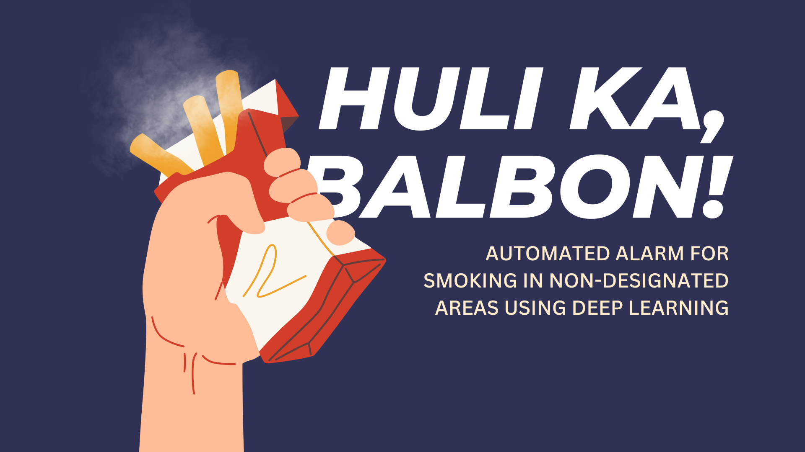

<h1>Authors</h1>
Paula Martinez, Paulo Medina, Jeonne Ramoso, Jeremiah Soliman

<h1>Project Description</h1>
This study explores the application of deep learning to distinguish smoking from non-smoking images by leveraging a pre-trained Xception model and Grad-CAM visualization techniques. By directly training the model's unfrozen convolutional layers, the study achieved a high test accuracy of 96% and insights into the model's decision-making processes. Notably, the model showed a propensity to focus on faces, hands, and cylindrical objects, which, while effective, posed potential limitations in misidentifying smoke-like gestures as smoking. The study not only demonstrates the feasibility of using direct training on deep models for specific classification tasks but also suggests using CCTV datasets for further enhancement of detection capabilities in varied environments.

<h1>Key Takeaways</h1>
<ol>
  <li>The heatmaps indicate that the model predominantly focuses on the body, face, and objects held by individuals when determining whether an image depicts smoking. This observation is consistent across images where the subject is actively smoking.</li> 
  <li>The model shows a tendency to misclassify non-smoking images as smoking if the subject has objects near the mouth or hands, such as pens or hand creams. This highlights a limitation in the model’s ability to distinguish between actual smoking and similar hand-to-mouth gestures.</li> 
  <li>In non-smoking scenarios, the model sometimes shifts its focus towards the background or other parts of the face, suggesting variability in the features it considers. This variability could be beneficial or detrimental depending on the specific context of the image and surrounding cues.</li> 
  <li>The model’s sensitivity to cylindrical objects near the mouth in "smoking" labeled images underscores the importance of context in training data. Ensuring that training datasets include a variety of contextual situations could help improve model robustness and reduce false positives.</li> 
  <li>The findings suggest a need for further model training to better discriminate between objects that are commonly misinterpreted as cigarettes. Incorporating a wider range of hand-to-mouth interactions in the training set might help the model learn more nuanced differences.</li>
</ol>
